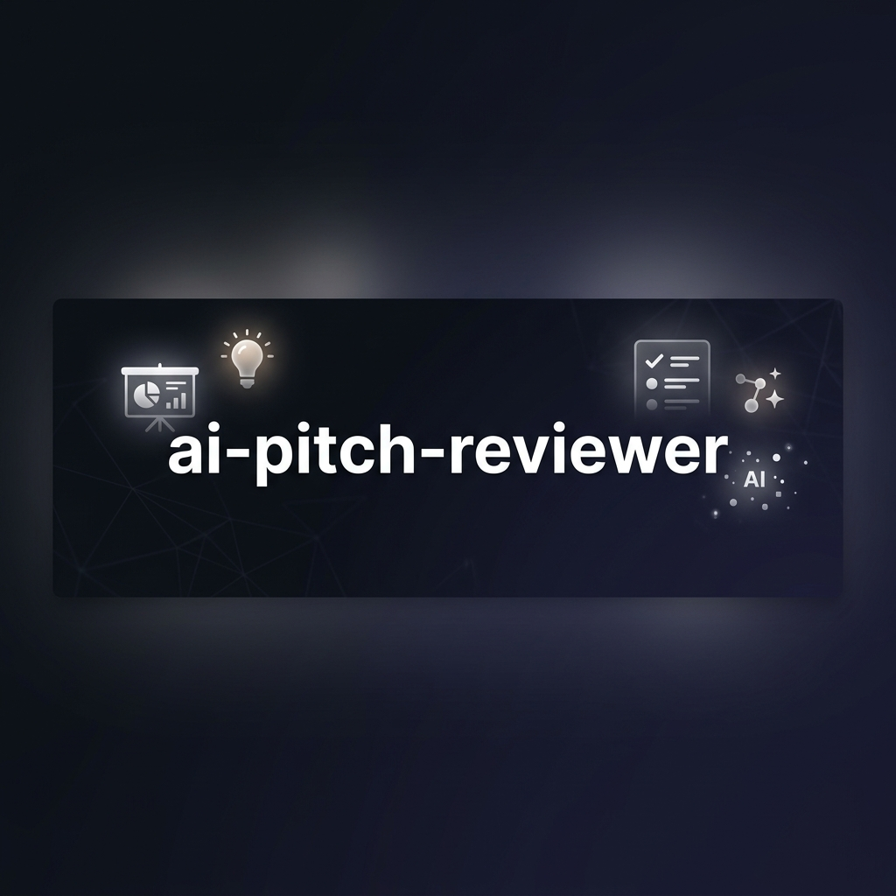

<div align="center">


# pitchperfect-ai

**ai-powered pitch deck analysis — clarity, storytelling, and investor-readiness scoring**

[](https://react.dev)
[](https://www.typescriptlang.org)
[](https://ai.google.dev)
[](LICENSE)

</div>

pitchperfect-ai is a full-stack evaluation tool that analyzes startup pitch decks. by providing your pitch text and selecting a target investor persona, the system runs a comprehensive analysis against key dimensions like clarity, narrative flow, and market positioning. 

```
┌─────────────────────────────────────────────────────────┐
│                    pitchperfect-ai                      │
│  ┌──────────┐  ┌──────────────────┐  ┌──────────────┐  │
│  │ pitch    │  │   evaluation     │  │  history     │  │
│  │ input    │  │   results        │  │  log         │  │
│  │          │  │                  │  │              │  │
│  │ text     ├──►   gemini ai      ├──►  local       │  │
│  │ persona  │  │                  │  │  storage     │  │
│  └──────────┘  └──────────────────┘  └──────────────┘  │
└─────────────────────────────────────────────────────────┘
```

## what it does

- **pitch analysis** — input your pitch text and receive a structured breakdown powered by the gemini api.
- **persona-based evaluation** — tailor feedback by selecting specific investor personas (e.g., vc, angel, growth).
- **history tracking** — save past pitches and their evaluation results to local storage for future reference.
- **modern ui/ux** — glassmorphism design with a fully responsive layout using tailwind css.
- **auth & state** — lightweight client-side authentication and state management to keep user histories distinct.

## tech stack

| layer | tech |
|-------|------|
| framework | react 19 + typescript |
| build | vite 6 |
| styling | tailwind css |
| ai | google gemini (`@google/genai`) |

## setup

### prerequisites

- node.js 18+
- a [gemini api key](https://aistudio.google.com/) for the ai evaluation engine

### run locally

1. clone the repository:
```bash
git clone https://github.com/swarajduttacv/pitch2.0.git
cd pitch2.0
```

2. install dependencies:
```bash
npm install
```

3. configure your environment variables:
create a `.env.local` file in the project root:
```env
GEMINI_API_KEY=your_gemini_api_key_here
```

4. start the dev server:
```bash
npm run dev
```

the app will run locally at `http://localhost:5173`.

## project structure

```
├── App.tsx                  # main application shell and state routing
├── index.tsx                # react entry point
├── index.html               # html shell
├── types.ts                 # typescript interfaces and types
├── components/
│   ├── AuthModal.tsx        # user authentication interface
│   ├── EvaluationResult.tsx # structured feedback display
│   ├── Header.tsx           # app navigation header
│   ├── Loader.tsx           # ai processing state
│   ├── PitchHistory.tsx     # previous pitch reviews
│   └── PitchInput.tsx       # text and persona selection
├── services/
│   ├── authService.ts       # local storage auth logic
│   └── geminiService.ts     # gemini ai integration logic
├── package.json
├── vite.config.ts
└── tsconfig.json
```

## license

[MIT](./LICENSE) © Swaraj Dutta 2025–2026
